# Bot data in PowerBI: End to end example
This is an example on how to display bot data such as questions asked, city/country of users using the bot, among other data in Power BI using App Insights and CosmosDB as sources.

>Disclosure. This repo asumes that you have already worked with Bots, QnA and/or LUIS before. If you haven't then these tutorials will sure be useful as the basic parts of such services are not covered here. Please check them first and come back here to learn how to use both services in the same bot: [Azure Bot Service documentation](https://azure.microsoft.com/en-us/services/bot-service/), [Create your first LUIS App](https://docs.microsoft.com/en-us/azure/cognitive-services/luis/luis-get-started-create-app) and [Create your first QnA Maker service](https://www.qnamaker.ai/)

## Quick summary
While it is valuable for a company to create a bot that helps internal/external users whether by accelerating response times from frequently asked questions or by helping them to request a procedure, etc, it is more valuable to gather insights on what said users are asking and seeing if the bot is really answering the way it should. 
Thus, this example gives an easy to follow path on how to gather insights from a bot using Cosmos DB and Application Insights as data sources.    

## Technologies used
- [Azure Bot Framework](https://dev.botframework.com/)
- [Azure Bot Service](https://azure.microsoft.com/en-us/services/bot-service/)
- [LUIS](https://azure.microsoft.com/en-us/services/cognitive-services/language-understanding-intelligent-service/)
- [QnA Maker](https://azure.microsoft.com/en-us/services/cognitive-services/qna-maker/)
- [Cosmos DB](https://azure.microsoft.com/en-us/services/cosmos-db/)
- [Application Insights](https://azure.microsoft.com/en-us/services/application-insights/)
- [Power BI](http://powerbi.com/)

## Architecture

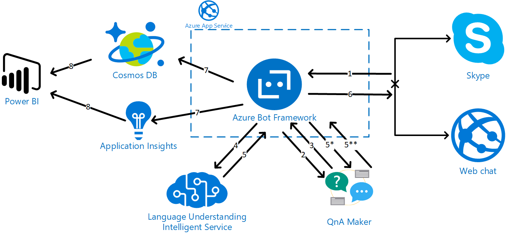

## A different approach on LUIS with QnA
On this example, LUIS service plays a support role instead of being the main actor on a regular LUIS-QnA integration service. 
What does this mean? Basically, that QnA will act as the only answer provider. As it is seen in the architecture above the conversation flow goes like this:
- User writes to bot
- Bot tries to retrieve an answer from QnA
- If there is an answer, it is posted to the user
    - The conversation ends
    - If there is not an answer, the bot sends the question to LUIS and LUIS tries to detect an intent
        - If LUIS doesn't return an intent, the conversation ends with the bot saying that it couldn't understand the question
        - If LUIS retrieves an intent, said intent is send to QnA as a new question
            - If QnA returns an answer, it is posted to the user and the conversation ends
            - If QnA doesn't return an answer, the converrsation ends with the bot saying that it couldn't understand the question

### 'One size fits all' scenario?
No, this scenario is recommended when:
- QnA will be the main knowledge base
- The bot goal is to answer questions from users instead of taking actions depending on commands from such users
- The ways of asking a unique question are complex because of the language / context / scenario of the bot's users
- There's no much need on detecting entities in a sentence using LUIS or other NLP services

## Preparing the scenario
> TIP. It is suggested to create a specific resource group for this example / test if you are using an Azure account from your company or simply you don't want to mess with other services created by colleagues in your organization.

### Creating the QnA maker service
A basic QnA Maker service must be created at the Azure Portal:
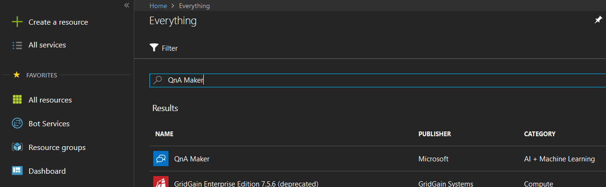

For testing purposes, the free tiers of Management and Search at QnA Maker will be more than enough:

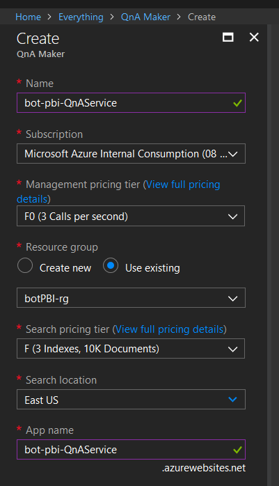

Once the service is listed, a new knowledge base must be created at the [QnA Maker portal](https://www.qnamaker.ai/Home/MyServices):
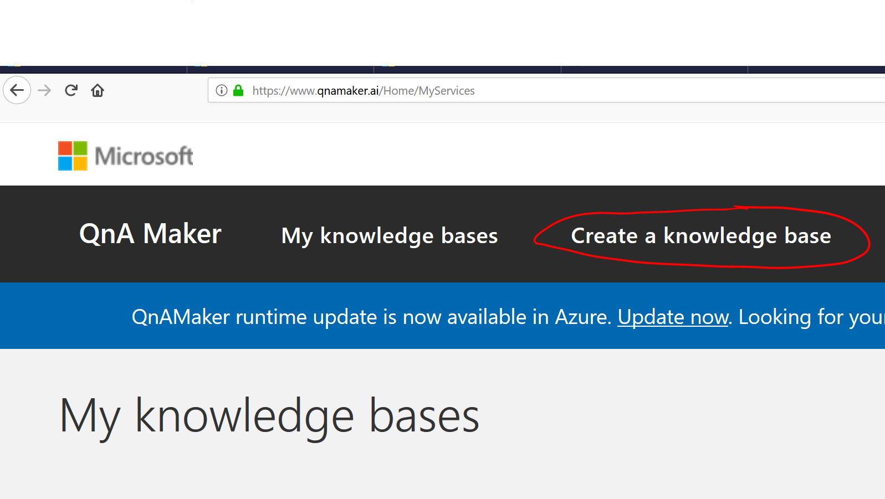

After filling the information from the QnA Service created a name and knowledge base source is needed. For this sample, the [Azure Support FAQ](https://azure.microsoft.com/en-us/support/faq/) is used:

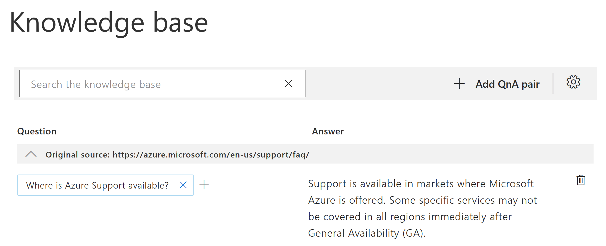

After the questions have been loaded, it is needed to save and train the service using the button at the upper right side of the page and then publish th service also using the button at the top menu:

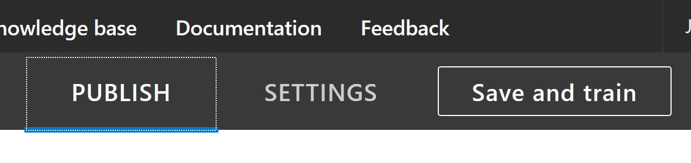

Once the service is deployed, the **endpoint**, **authorization key** and **knowledge base ID** should be stored to later use them in the bot:

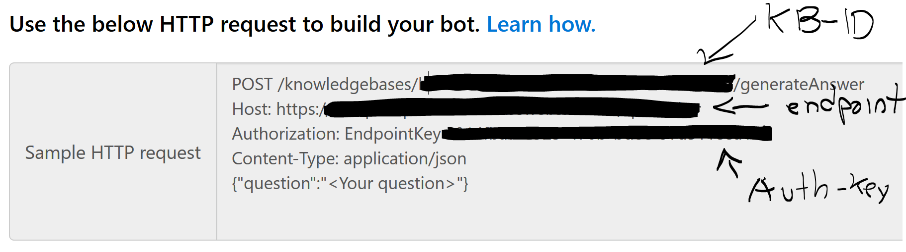

### Creating the LUIS service
A basic QnA Maker service must be created at the Azure Portal:

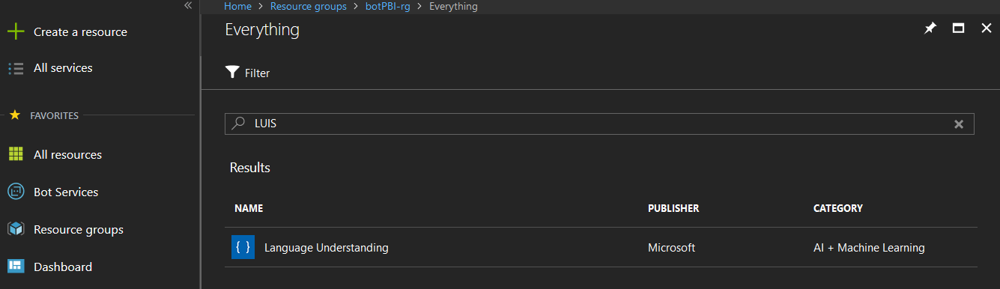

As with the QnA Maker, for testing purposes the free tier available of the LUIS service is used in this example:

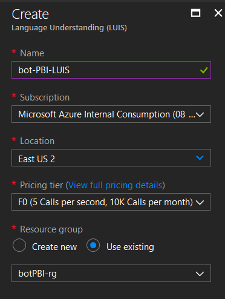

Once the LUIS service is ready, it is time to go to the [LUIS portal](https://www.luis.ai/home) and create a new App:

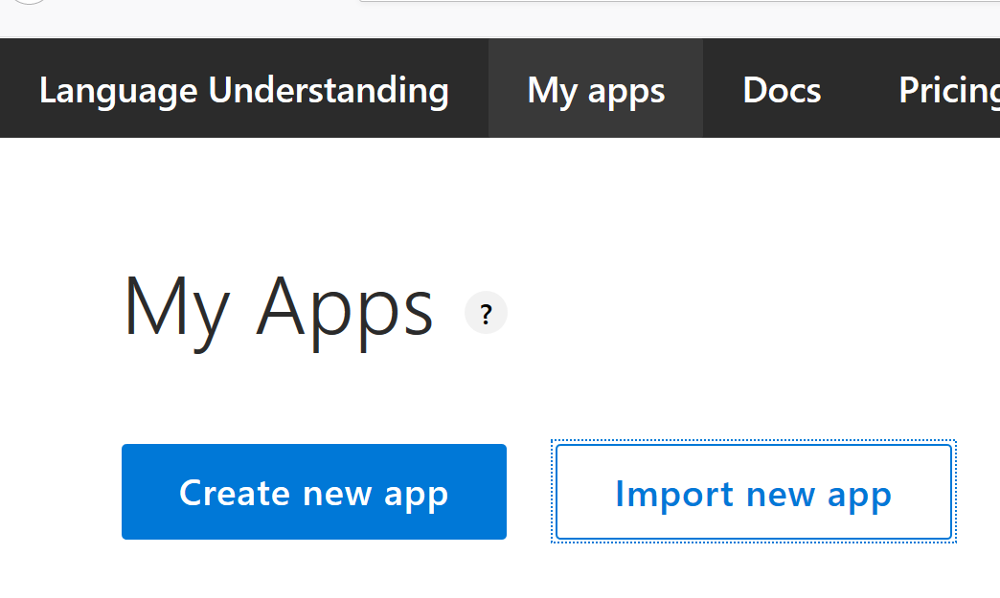

As mentioned before, the use of LUIS in this scenario is not so typical. The intents created are made of 3-4 words that will be sent again to QnA in the hopes that QnA returns an answer. As an example: The Intent **SubmitSupportRequest** will have utterances related to different ways of asking how to get or what it is the process of **Submitting a support request**.

#### Why? ####
Suppose the user asked:
> *"What are the steps to submit a support request in the Azure portal?"* 

and at firts the QnA service couldn't match this question to the question:
> *How do I submit a support request*

Then the original question will be sent to LUIS that will indeed identify that this is related to a *SubmitSupportRequest* intent. We'll extract the words *Submit, Support and Request* from the entity name and send this 3 words as a new question to QnA, the latter will now identify what the user meant to and will provide an answer. 

#### Training different LUIS intents ####
It is not necessary to map ALL of the QnA questions to a LUIS intent. Sometimes, questions like:
> *How do I submit a support request?*

are really straightforward. In this example it is recommended to create LUIS intents for tricky or hard questions in our knowledge base like:

> *How do I get support during an outage or service interruption event?*

> *Which support plan do I need in order to request a Root-Cause Analysis (RCA)*

After enough examples of intents and utterances, the LUIS service should be traing and published:

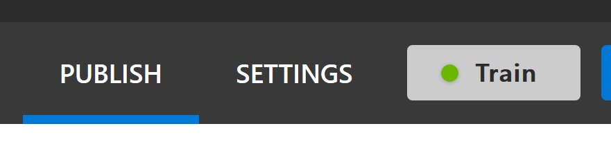

Once the publishing is completed, an App ID and a Subscription Key will be available at the end of the Publish page:

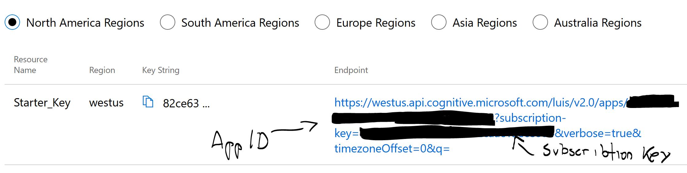 

### Creating the Azure Bot service 
### Creating the Cosmos DB service 

## Coding time ##
### Creating the dialog flow
### Custom Events in App Insights
### Writing to Cosmos DB

## Reporting time
### Cosmos DB
### Application Insights
#### Continuous export
#### Saving formated blobs
### Integration

## Conclusion 

## References