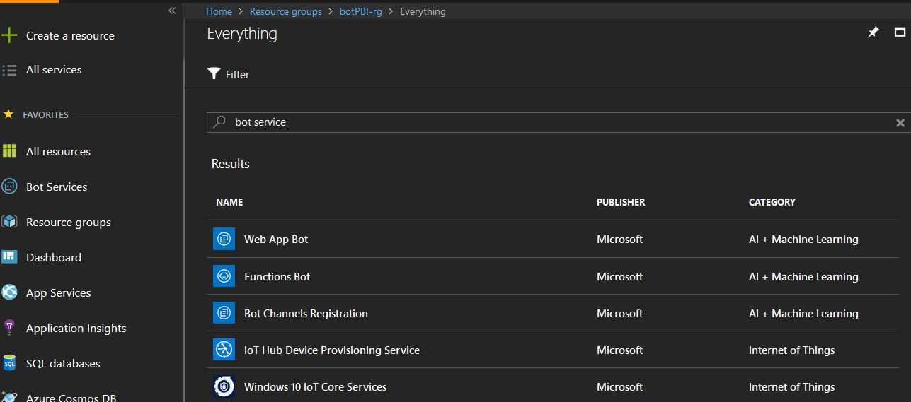
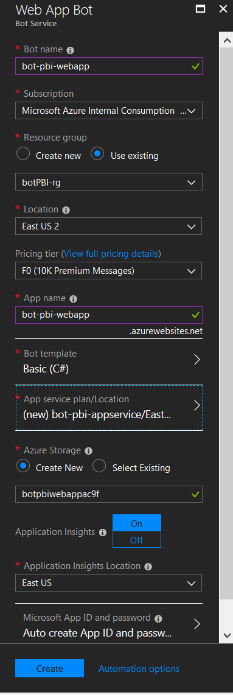
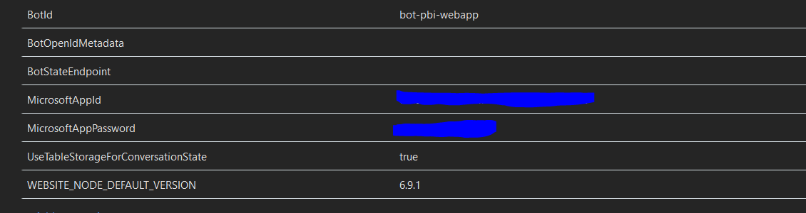
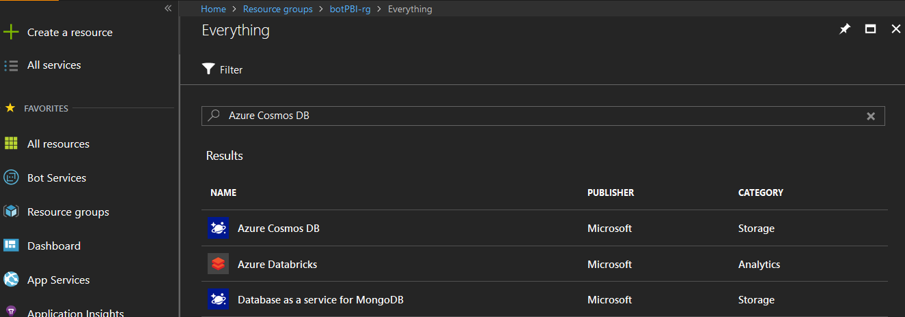
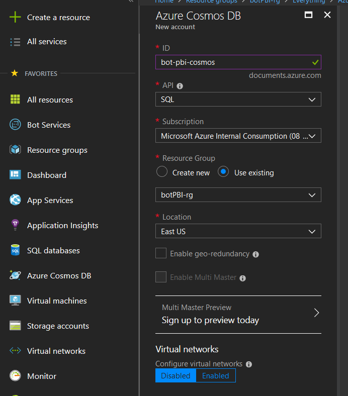
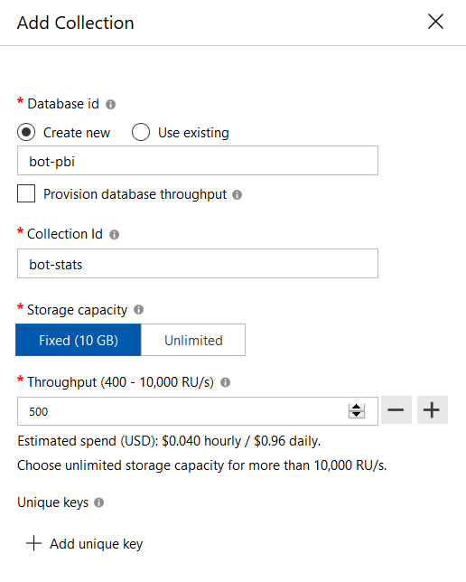
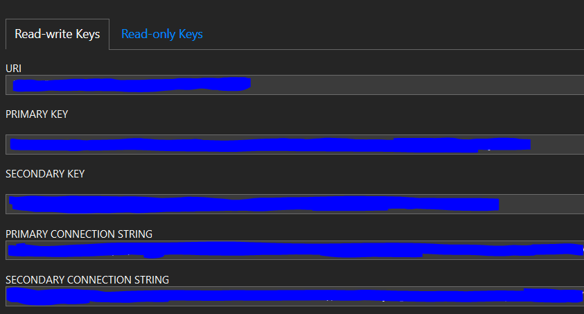
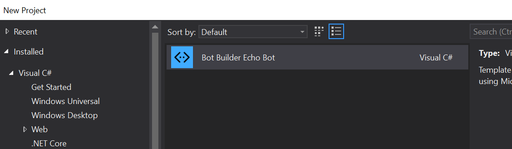
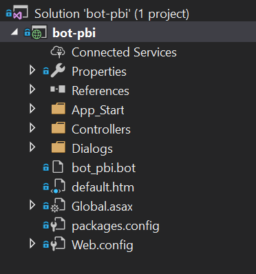

# Bot data in PowerBI: End to end example
This is an example on how to display bot data such as questions asked, city/country of users using the bot, among other data in Power BI using App Insights and CosmosDB as sources.

>Disclosure. This repo asumes that you have already worked with Bots, QnA and/or LUIS before. If you haven't then these tutorials will sure be useful as the basic parts of such services are not covered here. Please check them first and come back here to learn how to use both services in the same bot: [Azure Bot Service documentation](https://azure.microsoft.com/en-us/services/bot-service/), [Create your first LUIS App](https://docs.microsoft.com/en-us/azure/cognitive-services/luis/luis-get-started-create-app) and [Create your first QnA Maker service](https://www.qnamaker.ai/)

## Quick summary
While it is valuable for a company to create a bot that helps internal/external users whether by accelerating response times from frequently asked questions or by helping them to request a procedure, etc, it is more valuable to gather insights on what said users are asking and seeing if the bot is really answering the way it should. 
Thus, this example gives an easy to follow path on how to gather insights from a bot using Cosmos DB and Application Insights as data sources.    

## Technologies used
- [Azure Bot Framework](https://dev.botframework.com/)
- [Azure Bot Service](https://azure.microsoft.com/en-us/services/bot-service/)
- [LUIS](https://azure.microsoft.com/en-us/services/cognitive-services/language-understanding-intelligent-service/)
- [QnA Maker](https://azure.microsoft.com/en-us/services/cognitive-services/qna-maker/)
- [Cosmos DB](https://azure.microsoft.com/en-us/services/cosmos-db/)
- [Application Insights](https://azure.microsoft.com/en-us/services/application-insights/)
- [Power BI](http://powerbi.com/)

## Architecture


## A different approach on LUIS with QnA
On this example, LUIS service plays a support role instead of being the main actor on a regular LUIS-QnA integration service. 
What does this mean? Basically, that QnA will act as the only answer provider. As it is seen in the architecture above the conversation flow goes like this:
- User writes to bot
- Bot tries to retrieve an answer from QnA
- If there is an answer, it is posted to the user
    - The conversation ends
    - If there is not an answer, the bot sends the question to LUIS and LUIS tries to detect an intent
        - If LUIS doesn't return an intent, the conversation ends with the bot saying that it couldn't understand the question
        - If LUIS retrieves an intent, said intent is send to QnA as a new question
            - If QnA returns an answer, it is posted to the user and the conversation ends
            - If QnA doesn't return an answer, the converrsation ends with the bot saying that it couldn't understand the question

### 'One size fits all' scenario?
No, this scenario is recommended when:
- QnA will be the main knowledge base
- The bot goal is to answer questions from users instead of taking actions depending on commands from such users
- The ways of asking a unique question are complex because of the language / context / scenario of the bot's users
- There's no much need on detecting entities in a sentence using LUIS or other NLP services

## Preparing the scenario
> TIP. It is suggested to create a specific resource group for this example / test if you are using an Azure account from your company or simply you don't want to mess with other services created by colleagues in your organization.

### Creating the QnA maker service
A basic QnA Maker service must be created at the Azure Portal:


For testing purposes, the free tiers of Management and Search at QnA Maker will be more than enough:


Once the service is listed, a new knowledge base must be created at the [QnA Maker portal](https://www.qnamaker.ai/Home/MyServices):


After filling the information from the QnA Service created a name and knowledge base source is needed. For this sample, the [Azure Support FAQ](https://azure.microsoft.com/en-us/support/faq/) is used:


After the questions have been loaded, it is needed to save and train the service using the button at the upper right side of the page and then publish th service also using the button at the top menu:


Once the service is deployed, the **endpoint**, **authorization key** and **knowledge base ID** should be stored to later use them in the bot:


### Creating the LUIS service
A basic QnA Maker service must be created at the Azure Portal:


As with the QnA Maker, for testing purposes the free tier available of the LUIS service is used in this example:


Once the LUIS service is ready, it is time to go to the [LUIS portal](https://www.luis.ai/home) and create a new App:


As mentioned before, the use of LUIS in this scenario is not so typical. The intents created are made of 3-4 words that will be sent again to QnA in the hopes that QnA returns an answer. As an example: The Intent **SubmitSupportRequest** will have utterances related to different ways of asking how to get or what it is the process of **Submitting a support request**.

#### Why? ####
Suppose the user asked:
> *"What are the steps to submit a support request in the Azure portal?"* 

and at firts the QnA service couldn't match this question to the question:
> *How do I submit a support request*

Then the original question will be sent to LUIS that will indeed identify that this is related to a *SubmitSupportRequest* intent. We'll extract the words *Submit, Support and Request* from the entity name and send this 3 words as a new question to QnA, the latter will now identify what the user meant to and will provide an answer. 

#### Training different LUIS intents ####
It is not necessary to map ALL of the QnA questions to a LUIS intent. Sometimes, questions like:
> *How do I submit a support request?*

are really straightforward. In this example it is recommended to create LUIS intents for tricky or hard questions in our knowledge base like:

> *How do I get support during an outage or service interruption event?*

> *Which support plan do I need in order to request a Root-Cause Analysis (RCA)*

After enough examples of intents and utterances, the LUIS service should be traing and published:


Once the publishing is completed, an App ID and a Subscription Key will be available at the end of the Publish page:

 

### Creating the Azure Bot service
A **Web App Bot** service needs to be created at the Azure portal:



No custom settings are needed for the creation of the bot, and for this sample, the Free tier is more than enough:



Once the service is created, the *Bot App ID* and its *Password* can be retrieved at the **Application Settings** section:



### Creating the Cosmos DB service 
One of the last services needed in Azure is a Cosmos DB Service:



No custom settings are required for the demo, just selecting the SQL API for the database:



A database and a collection also need to be created:



One last thing before start coding! The credentials of the Cosmos DB service will be needed. They can be found at the **Keys** section in the **Settings** menu of the service:



## Coding time ##
>TIP. The Bot Builder template for Visual Studio is used in this sample. You can [download it here](https://marketplace.visualstudio.com/items?itemName=BotBuilder.BotBuilderV3).

If the Bot builder template is installed correctly this app type should appear at Visual Studio:

 

Altough this example is based around the use of the template, its use is not mandatory, the template merely helps with the creation of folders and the bot code structure:



>TIP: Update the Bot framework via Nuget Package manager to use the latest version

### Messages Controller
The code in the **Messages Controller** class is almost boilerplate code with the extra that it displays a welcome message to the user:

```csharp
public async Task<HttpResponseMessage> Post([FromBody]Activity activity)
{
    switch (activity.Type)
    {
        case ActivityTypes.Message:
            await Conversation.SendAsync(activity, () => new Dialogs.RootDialog());
            break;
        case ActivityTypes.ConversationUpdate:
            if (activity.MembersAdded.Any(o => o.Id == activity.Recipient.Id))
                await BotUtilities.DisplayWelcomeMessage(activity, "Bienvenido a nuestro Bot icbf!");
            break;
        default:
            break;
    }
    var response = Request.CreateResponse(HttpStatusCode.OK);
    return response;
}
```

### Creating the dialog flow
As stated in the architecture diagram, the dialog should go:
- User asks a question
- Question goes to QnA
- If QnA has an answer:
    - Return the answer
- If QnA does not have an answer:
    - Send the question to LUIS
        - If LUIS has an answer:
            - Return the answer
        - If LUIS does not have an answer:
            - Return a "could not understand the question" message

Converting this conversation flow to Bot Dialog generally gets us 3 dialogs:
- A root dialog that starts the conversation
- A QnA Dialog that connects to the QnA Service
- A LUIS Dialog that connects to LUIS service

In fact, the sample uses only two dialogs:
- A root dialog
- A QnA dialog

This is because the LUIS service is called in the  *after* method of the QnA dialog as it is seen in the source code.

#### Root dialog
The Root Dialog has 4 different methods:
- StartAsync
- MessageReceivedAsync
- AfterQnADialog
- GetLuisAnswer

**StartAsync** just receives the message from the user and waits for an answer that is processed in the **MessageReceivedAsync** method:
```csharp
public Task StartAsync(IDialogContext context)
{
    context.Wait(MessageReceivedAsync);

    return Task.CompletedTask;
}
```

**MessageReceivedAsync** method receives the question from the user and starts a new **QnaDialog** instance, once the instance is solved, it calls the **AfterQnADialog** method:
```csharp
private async Task MessageReceivedAsync(IDialogContext context, IAwaitable<object> result)
{
    var activity = await result as Activity;

    QnADialog dialog = new QnADialog();
    
    dialog.originalQuestion = activity.Text;
    await context.Forward(dialog, AfterQnADialog, activity, CancellationToken.None);
}        
```

The **AfterQnADialog** method answers the user in three different ways:
- If QnA service retrieved an answer then said answer is shown to the user
- If there was no result from QnA then LUIS service is called in the  **GetLuisAnswer** method, and the entity returned from LUIS is passed AGAIN to a QnA Dialog (in this case, the method **AfterQnADialog** will be called again)
- If on the second call there's no answer from QnA even after sending the LUIS entity as a question to QnA then the bot will reply with a "I couldn't understand you" message:
```csharp
private async Task AfterQnADialog(IDialogContext context, IAwaitable<object> result)
{
    var message = context.Activity as IMessageActivity;
    string typeResultInQnA = (await result as Activity).Text;

    switch (typeResultInQnA)
    {
        case SharedObjects.ResultFromQnA.NO_RESULT_FROM_QNA:
            QnADialog dialog = new QnADialog();
            dialog.isComingFromLuis = true;


            string LuisAnswer = GetLuisAnswer(message.Text, out double score);

            if (LuisAnswer == "None")
            {
                await context.PostAsync(SharedObjects.NO_RESULT_ANSWER);

                AppInsightsTelemetryClient.TrackEvent(message.Id);
                AppInsightsTelemetryClient.InsertTransaction(message, message.Text, 0, score, SharedObjects.NO_RESULT_ANSWER_IN_DB, LuisAnswer, AnswerType.noAnswer);
            }
            else
            {
                dialog.originalQuestion = message.Text;
                message.Text = LuisAnswer;
                await context.Forward(dialog, AfterQnADialog, message);
            
            }
            break;

        case SharedObjects.ResultFromQnA.NO_RESULT_FROM_QNA_AND_LUIS:
            await context.PostAsync(SharedObjects.NO_RESULT_ANSWER);
            break;

        default:
            context.Done(this);
            break;
    }
}
```

The **GetLuisAnswer** method simply calls the LUIS service and tries to retrieve an intent that then will be sent to the QnA service as a question:
```csharp
private string GetLuisAnswer(string text, out double score)
{
    string LUIS_APP_ID = ConfigurationManager.AppSettings["LuisApplicationId"];
    string LUIS_KEY = ConfigurationManager.AppSettings["LuisSubscriptionKey"];
    LuisClient luisClient = new LuisClient(LUIS_APP_ID, LUIS_KEY);
    var resultLuis = luisClient.Predict(text).Result;
    var luisOriginalIntent = resultLuis.TopScoringIntent.Name;
    score = resultLuis.TopScoringIntent.Score;
    return luisOriginalIntent.Replace('-', ' ');
}
```

#### QnA Dialog
Since the QnA Dialog class is used two times depending on if the first time the service was not able to retrieve an answer, it has some attributes that come handy such as a boolean to define if the specific instance was called using LUIS or not:

```csharp
public class QnADialog : QnAMakerDialog
{
    private static string typeResultInQnA;
    private double QnAMakerScoreThresHold;
    public string originalQuestion { get; set; }
    public bool isComingFromLuis { get; set; }

    public QnADialog() : base(
        new QnAMakerService(
            new QnAMakerAttribute(
                ConfigurationManager.AppSettings["QnAMakerAuthKey"],
                ConfigurationManager.AppSettings["QnAMakerKnowledgeBaseID"],
                "No se encontró resultado",
                0,
                Convert.ToInt32(ConfigurationManager.AppSettings["QnAMakerTop"]),
                ConfigurationManager.AppSettings["QnAMakerEndPointHostName"])))
    {
        QnAMakerScoreThresHold = Convert.ToDouble(ConfigurationManager.AppSettings["QnAMakerScoreThresHold"], new CultureInfo("en-us"));
        isComingFromLuis = false;
    }
    /// More code here
}
```
###### The bug with QnA always returning "No good match found in KB"
Currently, there's a bug in the **QnAMakerDialog** class that makes the bot send the user a "No good match found in KB" message if the service couldn't find an answer, this happens even if the QnADialog constructor was overwritten. And since the example handles the *No answer* scenario outside of the QnA Dialog a simple workaround to stop the Bot to answer with the **"No good ma.."** message is to override the **IsConfidentAnswer** method to *ALWAYS* return true: 
```csharp
protected override bool IsConfidentAnswer(QnAMakerResults qnaMakerResults)
{
    return true;
}
```

This will force the bot to then enter to the **RespondFromQnAMakerResultAsync** that resolves if the service has an answer or not for the user:
```csharp
protected override async Task RespondFromQnAMakerResultAsync(IDialogContext context, IMessageActivity message, QnAMakerResults result)
{
    var answers = GetAnswerData(result);
    var counter = answers.Count();

    if (counter == 0)
    {
        if (isComingFromLuis)
        {
            AppInsightsTelemetryClient.TrackEvent(message.Id);
            AppInsightsTelemetryClient.InsertTransaction(context.Activity as IMessageActivity,
                originalQuestion, 0, 0, SharedObjects.NO_RESULT_ANSWER_IN_DB, (context.Activity as IMessageActivity).Text,
            AnswerType.noAnswer);
            typeResultInQnA = SharedObjects.ResultFromQnA.NO_RESULT_FROM_QNA_AND_LUIS;
        }

        else
            typeResultInQnA = SharedObjects.ResultFromQnA.NO_RESULT_FROM_QNA;
    }
    else
    {
        typeResultInQnA = SharedObjects.ResultFromQnA.RESULT_FROM_QNA;

        AppInsightsTelemetryClient.TrackEvent(message.Id);
        AppInsightsTelemetryClient.InsertTransaction(context.Activity as IMessageActivity,
                        originalQuestion, counter, answers[0].Score, answers[0].Questions[0],
                        (isComingFromLuis ? message.Text : "None"),
                        (isComingFromLuis ? AnswerType.QnALuis : AnswerType.QnA));

        var carrusel = context.MakeMessage();
        carrusel.AttachmentLayout = AttachmentLayoutTypes.Carousel;
        var options = new List<Attachment>();

        if (counter == 1)
            await context.PostAsync($"I found 1 answer:");
        else
            await context.PostAsync($"Are any of these {counter} answers helpful?");

        foreach (var qnaMakerResult in answers)
            options.Add(CreateCard(qnaMakerResult));

        carrusel.Attachments = options;

        await context.PostAsync(carrusel);
    }
}
```

### Custom Events in App Insights and Writing to Cosmos DB
The sample uses a class called **AppInsightsTelemetryClient** that contains two methods:
- **TrackEvent** to write to Application Insights. This is simply done thanks to the SDK from Application Insights. The SDK has a **TelemetryClient** class that counts with a **TrackEvent** method. This **TrackEvent** method grabs a custom event name and optionally receives a dictionary of custom attributes that App Insights will store. For more information take a look at [Custom Events documentation inside Application insights](https://docs.microsoft.com/en-us/azure/application-insights/app-insights-api-custom-events-metrics).

- **InsertTransaction** to write to CosmosDB
```csharp
public static class AppInsightsTelemetryClient
{
    static TelemetryClient _instance;
    public static TelemetryClient GetInstance()
    {
        if (_instance == null)
            _instance = new TelemetryClient();
        return _instance;
    }

    public static void TrackEvent(string custonNameEvent)
    {
        _instance.TrackEvent(custonNameEvent);
    }

    public static void InsertTransaction( IMessageActivity activity, 
        string originalQuestion, int counter,
        double maxScore, string maxScoreQuestion,
        string LuisIntent, AnswerType answerType)
    {
        var persistency = SharedObjects.DatabaseManager;

        BotTracking tracking = new BotTracking
        {
            IdActivity = activity.Id,
            IdConversation = activity.Conversation.Id,
            EntryQuestion = originalQuestion,
            NumAnswer = counter,
            AnswerType = answerType,
            MaxScore = maxScore,
            LuisIntent = LuisIntent,
            MaxScoredQuestion = maxScoreQuestion
        };
        var transactionResult = persistency.AddData(tracking);

        if (!transactionResult.Success)
        {
            if (transactionResult.Ex != null)
                Trace.TraceWarning($"{transactionResult.Message}: {transactionResult.Ex.Message} ");
            else
                Trace.TraceWarning(transactionResult.Message);
        }
    }
}
```
Behind the simplicity of the **InsertTransaction** method lies a more robust and complex database handler in form of an interface called **IDBManager** that has an **AddData** method. The specific implementation for a Cosmos database lies in the **DocumentDBManager** class:
```csharp
public DBTransactionResult AddData(object info)
{
    var result = new DBTransactionResult();
    string typename = info.GetType().Name;

    try
    {
        switch (typename)
        {
            case nameof(BotTracking):
                var rr = _docuClient.CreateDocumentAsync(
                    UriFactory.CreateDocumentCollectionUri(_dbName, _collectionID), info
                    ).Result;
                break;
            default:
                result.Success = false;
                result.Message = "Tipo de información no esperado al insertar en la base de datos";
                break;
        }
    }
    catch (DocumentClientException ex)
    {
        result.SetException(ex);
    }
    return result;

}
```
#### Handling of CosmosDB and/or other databases
Look at the DAL folder in the source code to better understand the future handling of different database providers. Basically,the DatabaseProvider is defined in the **web.config** file:
```xml
<add key="DBType" value="DocumentDB"/>
```
And the value is readed in the **Global.asax.cs**'s **Aplication_Start** method:
```csharp
protected void Application_Start()
{
    GlobalConfiguration.Configure(WebApiConfig.Register);

    AppInsightsTelemetryClient.GetInstance();

    try
    {
        // Some code here...

        if (Enum.TryParse<DAL.DBType>(ConfigurationManager.AppSettings["DBType"], out DAL.DBType dbt))
        {
            SharedObjects.DatabaseManager = DBManagerFactory.GetInstance(dbt, parameters);
        }
        else
        {
            // Some code here
        }
    }
    catch (Exception ex)
    {
        // Some code here
    }
}
```

## Reporting time
### Cosmos DB
### Application Insights